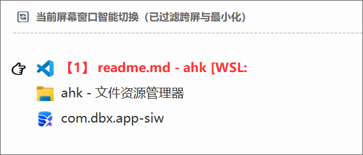
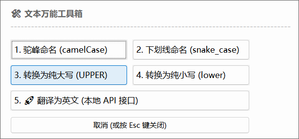

### 自用[autohotkey](https://www.autohotkey.com/)脚本

点击`.ahk`文件直接运行

- `mytab.ahk` Windows使用`alt`+`tab`过滤最小化的窗口

- `quictsearch.ahk` Windows使用`ctrl`+`shift`+`alt`+`C`快捷搜索选中的词

- `quictsearchtoos.ahk`Windows使用`ctrl`+`shift`+`alt`+`T`快捷对选中的词进行快捷操作

        翻译是用的本地`LibreTranslate`翻译

